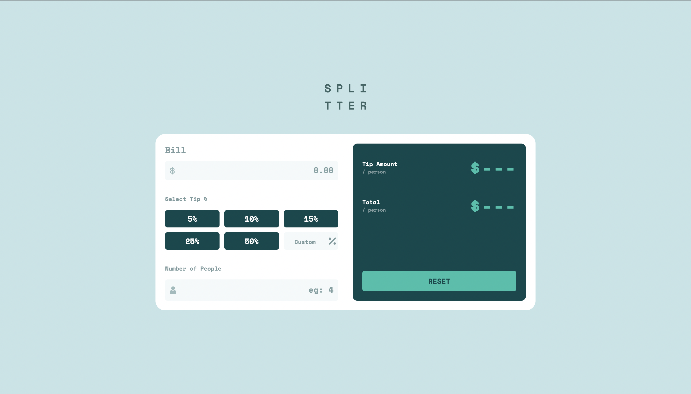

# Frontend Mentor - Tip calculator app solution

This is a solution to the [Tip calculator app challenge on Frontend Mentor](https://www.frontendmentor.io/challenges/tip-calculator-app-ugJNGbJUX). Frontend Mentor challenges help you improve your coding skills by building realistic projects.

## Table of contents

- [Overview](#overview)
  - [The challenge](#the-challenge)
  - [Screenshot](#screenshot)
  - [Links](#links)
  - [Built with](#built-with)
  - [Useful resources](#useful-resources)
- [Author](#author)
- [Acknowledgments](#acknowledgments)

**Note: Delete this note and update the table of contents based on what sections you keep.**

### The challenge

Users should be able to:

- View the optimal layout for the app depending on their device's screen size
- See hover states for all interactive elements on the page
- Calculate the correct tip and total cost of the bill per person

### Screenshot

### Links

- Solution URL: [https://github.com/Divjas-Singh/tip-calculator-app/](https://github.com/Divjas-Singh/tip-calculator-app/)
- Live Site URL: [https://divjas-singh.github.io/tip-calculator-app/](https://divjas-singh.github.io/tip-calculator-app/)

### Built with

- Semantic HTML5 markup
- CSS custom properties
- Flexbox
- CSS Grid
- Mobile-first workflow
- [Styled Components](https://styled-components.com/) - For styles
- media Queries

### What I learned

During this project I learned more about project workflow and also using function instead of directly declaring actions in javascript.

### Useful resources

- [https://neumorphism.io/](https://neumorphism.io/) - This helped me in creating neat and aesthetic buttons easily.
- [https://regexr.com/](https://regexr.com/) - This is an amazing site which helped me finally understanding and implementing Regular Expressions for form validation. I'd recommend it to anyone still learning this concept.

## Author

- Frontend Mentor - [@Divjas-Singh](https://www.frontendmentor.io/profile/Divjas-Singh)
